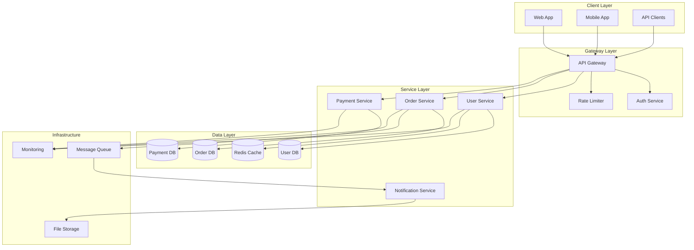

# Rule 16A: Documentation Standards

## Overview
Documentation as Code principles with automated generation, maintenance, and quality assurance to ensure comprehensive, accurate, and accessible project documentation.

## Core Principles

### Documentation as Code
- Documentation lives alongside code in version control
- Documentation follows same review process as code
- Automated validation and generation where possible
- Documentation deploys with applications

### Documentation Architecture
```yaml
# .docs/architecture.yaml
documentation_structure:
  technical:
    api_reference: "Auto-generated from OpenAPI specs"
    architecture: "Living architecture documentation"
    runbooks: "Operational procedures and troubleshooting"
    deployment: "Infrastructure and deployment guides"
  
  user_facing:
    getting_started: "Quick start guides and tutorials"
    user_guides: "Feature documentation and workflows"
    faqs: "Frequently asked questions"
    changelog: "Version history and migration guides"
  
  developer:
    contributing: "Development setup and guidelines"
    code_style: "Coding standards and conventions"
    testing: "Testing strategies and examples"
    security: "Security guidelines and best practices"

tooling:
  generator: "docusaurus"
  api_docs: "redoc"
  diagrams: "mermaid"
  validation: "vale"
  deployment: "netlify"
```

## Implementation Standards

### 1. Documentation Framework Setup

#### Docusaurus Configuration
```javascript
// docusaurus.config.js
const config = {
  title: 'Project Documentation',
  tagline: 'Comprehensive project documentation',
  url: 'https://your-docs-site.com',
  baseUrl: '/',
  onBrokenLinks: 'throw',
  onBrokenMarkdownLinks: 'warn',
  favicon: 'img/favicon.ico',

  organizationName: 'your-org',
  projectName: 'your-project',

  i18n: {
    defaultLocale: 'en',
    locales: ['en'],
  },

  presets: [
    [
      'classic',
      {
        docs: {
          sidebarPath: require.resolve('./sidebars.js'),
          editUrl: 'https://github.com/your-org/your-repo/tree/main/',
          showLastUpdateAuthor: true,
          showLastUpdateTime: true,
        },
        blog: {
          showReadingTime: true,
          editUrl: 'https://github.com/your-org/your-repo/tree/main/',
        },
        theme: {
          customCss: require.resolve('./src/css/custom.css'),
        },
      },
    ],
  ],

  themeConfig: {
    navbar: {
      title: 'Documentation',
      logo: {
        alt: 'Project Logo',
        src: 'img/logo.svg',
      },
      items: [
        {
          type: 'doc',
          docId: 'intro',
          position: 'left',
          label: 'Docs',
        },
        {
          to: '/api',
          label: 'API',
          position: 'left',
        },
        {
          href: 'https://github.com/your-org/your-repo',
          label: 'GitHub',
          position: 'right',
        },
      ],
    },
    footer: {
      style: 'dark',
      links: [
        {
          title: 'Docs',
          items: [
            {
              label: 'Getting Started',
              to: '/docs/intro',
            },
          ],
        },
        {
          title: 'Community',
          items: [
            {
              label: 'Stack Overflow',
              href: 'https://stackoverflow.com/questions/tagged/your-project',
            },
          ],
        },
      ],
      copyright: `Copyright © ${new Date().getFullYear()} Your example.`,
    },
    prism: {
      theme: require('prism-react-renderer/themes/github'),
      darkTheme: require('prism-react-renderer/themes/dracula'),
      additionalLanguages: ['bash', 'yaml', 'json'],
    },
  },

  plugins: [
    [
      'redocusaurus',
      {
        specs: [
          {
            spec: 'openapi/api.yaml',
            route: '/api/',
          },
        ],
        theme: {
          primaryColor: '#1890ff',
        },
      },
    ],
  ],
};

module.exports = config;
```

#### Documentation Structure
```bash
# Documentation directory structure
docs/
├── README.md                 # Project overview
├── getting-started/
│   ├── installation.md
│   ├── quick-start.md
│   └── configuration.md
├── user-guide/
│   ├── features/
│   ├── tutorials/
│   └── troubleshooting.md
├── api-reference/
│   ├── authentication.md
│   ├── endpoints/
│   └── webhooks.md
├── architecture/
│   ├── overview.md
│   ├── components.md
│   ├── data-flow.md
│   └── security.md
├── deployment/
│   ├── local.md
│   ├── staging.md
│   └── production.md
├── development/
│   ├── setup.md
│   ├── contributing.md
│   ├── testing.md
│   └── debugging.md
└── operations/
    ├── monitoring.md
    ├── backup.md
    └── disaster-recovery.md
```

### 2. API Documentation Automation

#### OpenAPI Specification
```yaml
# openapi/api.yaml
openapi: 3.0.3
info:
  title: Project API
  description: |
    Comprehensive API for project management and operations.
    
    ## Authentication
    This API uses OAuth 2.0 with PKCE for authentication.
    
    ## Rate Limiting
    Requests are limited to 1000 per hour per user.
    
    ## Versioning
    API versioning is handled through the URL path (/v1/, /v2/, etc.).
  version: "1.0.0"
  contact:
    name: API Support
    url: https://example.com/support
    email: api-support@example.com
  license:
    name: MIT
    url: https://opensource.org/licenses/MIT

servers:
  - url: https://api.example.com/v1
    description: Production server
  - url: https://staging-api.example.com/v1
    description: Staging server

security:
  - OAuth2:
      - read
      - write

paths:
  /users:
    get:
      summary: List users
      description: |
        Retrieve a paginated list of users with optional filtering.
        
        ### Filtering
        - `status`: Filter by user status (active, inactive, pending)
        - `role`: Filter by user role (admin, user, guest)
        
        ### Sorting
        Users can be sorted by: `created_at`, `updated_at`, `name`, `email`
      parameters:
        - name: page
          in: query
          description: Page number for pagination
          schema:
            type: integer
            minimum: 1
            default: 1
        - name: limit
          in: query
          description: Number of items per page
          schema:
            type: integer
            minimum: 1
            maximum: 100
            default: 20
        - name: status
          in: query
          description: Filter by user status
          schema:
            type: string
            enum: [active, inactive, pending]
      responses:
        '200':
          description: Successful response
          content:
            application/json:
              schema:
                type: object
                properties:
                  data:
                    type: array
                    items:
                      $ref: '#/components/schemas/User'
                  pagination:
                    $ref: '#/components/schemas/Pagination'
              examples:
                default:
                  summary: Default user list
                  value:
                    data:
                      - id: "123e4567-e89b-12d3-a456-426614174000"
                        email: "user@example.com"
                        name: "John Doe"
                        status: "active"
                        created_at: "2023-01-01T00:00:00Z"
                    pagination:
                      page: 1
                      limit: 20
                      total: 100
                      pages: 5

components:
  schemas:
    User:
      type: object
      required:
        - id
        - email
        - name
        - status
      properties:
        id:
          type: string
          format: uuid
          description: Unique identifier for the user
          example: "123e4567-e89b-12d3-a456-426614174000"
        email:
          type: string
          format: email
          description: User's email address
          example: "user@example.com"
        name:
          type: string
          description: User's full name
          example: "John Doe"
        status:
          type: string
          enum: [active, inactive, pending]
          description: Current status of the user
          example: "active"
        created_at:
          type: string
          format: date-time
          description: Timestamp when the user was created
          example: "2023-01-01T00:00:00Z"
    
    Pagination:
      type: object
      properties:
        page:
          type: integer
          description: Current page number
        limit:
          type: integer
          description: Items per page
        total:
          type: integer
          description: Total number of items
        pages:
          type: integer
          description: Total number of pages

  securitySchemes:
    OAuth2:
      type: oauth2
      flows:
        authorizationCode:
          authorizationUrl: https://auth.example.com/oauth/authorize
          tokenUrl: https://auth.example.com/oauth/token
          scopes:
            read: Read access to resources
            write: Write access to resources
```

#### API Documentation Generator
```javascript
// scripts/generate-api-docs.js
const swaggerJsdoc = require('swagger-jsdoc');
const fs = require('fs');
const yaml = require('js-yaml');

const options = {
  definition: {
    openapi: '3.0.3',
    info: {
      title: 'API Documentation',
      version: '1.0.0',
      description: 'Auto-generated API documentation from code comments',
    },
  },
  apis: ['./src/routes/*.js', './src/models/*.js'],
};

/**
 * Generate API documentation from JSDoc comments
 */
class APIDocGenerator {
  constructor() {
    this.specs = swaggerJsdoc(options);
  }

  /**
   * Generate OpenAPI specification file
   */
  generateSpec() {
    const yamlStr = yaml.dump(this.specs, {
      indent: 2,
      lineWidth: 120,
      noRefs: true,
    });

    fs.writeFileSync('./docs/api/openapi.yaml', yamlStr);
    console.log('✅ OpenAPI specification generated');
  }

  /**
   * Generate markdown documentation
   */
  generateMarkdown() {
    const paths = Object.keys(this.specs.paths);
    let markdown = '# API Reference\n\n';

    paths.forEach(path => {
      const methods = Object.keys(this.specs.paths[path]);
      
      methods.forEach(method => {
        const operation = this.specs.paths[path][method];
        markdown += `## ${method.toUpperCase()} ${path}\n\n`;
        markdown += `${operation.summary}\n\n`;
        
        if (operation.description) {
          markdown += `${operation.description}\n\n`;
        }

        // Parameters
        if (operation.parameters) {
          markdown += '### Parameters\n\n';
          markdown += '| Name | Type | Required | Description |\n';
          markdown += '|------|------|----------|-------------|\n';
          
          operation.parameters.forEach(param => {
            const required = param.required ? 'Yes' : 'No';
            markdown += `| ${param.name} | ${param.schema?.type || 'string'} | ${required} | ${param.description || ''} |\n`;
          });
          markdown += '\n';
        }

        // Responses
        if (operation.responses) {
          markdown += '### Responses\n\n';
          Object.keys(operation.responses).forEach(code => {
            const response = operation.responses[code];
            markdown += `**${code}**: ${response.description}\n\n`;
          });
        }

        markdown += '---\n\n';
      });
    });

    fs.writeFileSync('./docs/api/reference.md', markdown);
    console.log('✅ API markdown documentation generated');
  }

  /**
   * Validate API documentation
   */
  validate() {
    const errors = [];

    // Check for required fields
    if (!this.specs.info.title) errors.push('Missing API title');
    if (!this.specs.info.version) errors.push('Missing API version');

    // Check paths have descriptions
    Object.keys(this.specs.paths).forEach(path => {
      Object.keys(this.specs.paths[path]).forEach(method => {
        const operation = this.specs.paths[path][method];
        if (!operation.summary) {
          errors.push(`Missing summary for ${method.toUpperCase()} ${path}`);
        }
      });
    });

    if (errors.length > 0) {
      console.error('❌ API documentation validation failed:');
      errors.forEach(error => console.error(`  - ${error}`));
      process.exit(1);
    }

    console.log('✅ API documentation validation passed');
  }
}

// Generate documentation
const generator = new APIDocGenerator();
generator.validate();
generator.generateSpec();
generator.generateMarkdown();
```

### 3. Architecture Documentation

#### Architecture Decision Records (ADRs)
```markdown
<!-- docs/architecture/decisions/001-microservices-architecture.md -->
# ADR-001: Adopt Microservices Architecture

## Status
Accepted

## Context
We need to scale our monolithic application to handle increased load and enable multiple teams to work independently. The current monolithic architecture is becoming difficult to maintain and deploy.

## Decision
We will adopt a microservices architecture with the following characteristics:
- Domain-driven service boundaries
- Independent deployability
- Database per service
- API-first communication
- Event-driven architecture for loose coupling

## Consequences

### Positive
- Independent team development and deployment
- Technology diversity per service
- Better fault isolation
- Improved scalability

### Negative
- Increased operational complexity
- Network latency between services
- Data consistency challenges
- Distributed system complexity

## Implementation
1. Identify service boundaries using domain-driven design
2. Extract user management service first (strangler fig pattern)
3. Implement API gateway for routing and cross-cutting concerns
4. Set up service mesh for observability and security
5. Establish CI/CD pipelines for each service

## Monitoring
- Service response times < 100ms (95th percentile)
- Service availability > 99.9%
- Cross-service call success rate > 99.5%
- Deployment frequency daily per service
```

#### System Architecture Documentation
```markdown
<!-- docs/architecture/system-overview.md -->
# System Architecture Overview

## High-Level Architecture



## Service Boundaries

### User Service
**Responsibility**: User management, authentication, profiles
**Technology**: Node.js, PostgreSQL
**API**: RESTful with GraphQL federation
**Team**: Identity Team

### Order Service
**Responsibility**: Order management, inventory, fulfillment
**Technology**: Java Spring Boot, PostgreSQL
**API**: RESTful with async events
**Team**: Commerce Team

### Payment Service
**Responsibility**: Payment processing, billing, refunds
**Technology**: Python FastAPI, PostgreSQL
**API**: RESTful with webhook callbacks
**Team**: Payments Team

### Notification Service
**Responsibility**: Email, SMS, push notifications
**Technology**: Go, MongoDB
**API**: Event-driven consumption
**Team**: Platform Team

## Data Flow

### Order Processing Flow
1. Client creates order via API Gateway
2. Order Service validates and creates order
3. Order Service publishes OrderCreated event
4. Payment Service processes payment
5. Payment Service publishes PaymentProcessed event
6. Notification Service sends confirmation
7. Order Service updates order status

### Authentication Flow
1. Client requests authentication
2. Auth Service validates credentials
3. Auth Service issues JWT token
4. API Gateway validates token for protected routes
5. Services receive user context from gateway

## Cross-Cutting Concerns

### Security
- OAuth 2.0 with PKCE for authentication
- JWT tokens with short expiration
- mTLS between services
- API rate limiting per user/IP
- Input validation at gateway and service levels

### Observability
- Distributed tracing with correlation IDs
- Structured logging with ELK stack
- Prometheus metrics with Grafana dashboards
- Health checks and alerting
- Performance monitoring with APM

### Resilience
- Circuit breakers for external dependencies
- Retry policies with exponential backoff
- Bulkhead pattern for resource isolation
- Graceful degradation strategies
- Chaos engineering practices
```

### 4. Documentation Quality Assurance

#### Vale Configuration for Style Guide
```yaml
# .vale.ini
StylesPath = styles
MinAlertLevel = suggestion

[*]
BasedOnStyles = Vale, write-good
Vale.Spelling = YES
write-good.Headings = YES
write-good.Passive = NO

[*.md]
BasedOnStyles = Vale, write-good, write-good
write-good.We = NO

[docs/api/*.md]
BasedOnStyles = Vale, write-good
write-good.FirstPerson = NO
```

#### Documentation Linting
```yaml
# styles/Custom/TechnicalTerms.yml
extends: existence
message: "Consider using '%s' instead of '%s'"
level: suggestion
ignorecase: true
swap:
  API endpoint: API
  login: sign in
  logout: sign out
  e-mail: email
  website: site
```

#### Documentation Testing
```javascript
// scripts/test-docs.js
const fs = require('fs');
const path = require('path');
const markdownLinkCheck = require('markdown-link-check');
const glob = require('glob');

/**
 * Test documentation quality and integrity
 */
class DocumentationTester {
  constructor() {
    this.errors = [];
    this.warnings = [];
  }

  /**
   * Test all markdown files for broken links
   */
  async testLinks() {
    const files = glob.sync('docs/**/*.md');
    
    for (const file of files) {
      const content = fs.readFileSync(file, 'utf8');
      
      await new Promise((resolve) => {
        markdownLinkCheck(content, { baseUrl: 'file://' + path.dirname(path.resolve(file)) }, (err, results) => {
          if (err) {
            this.errors.push(`${file}: ${err.message}`);
            resolve();
            return;
          }

          results.forEach(result => {
            if (result.status === 'dead') {
              this.errors.push(`${file}: Broken link - ${result.link}`);
            } else if (result.status === 'error') {
              this.warnings.push(`${file}: Link error - ${result.link}`);
            }
          });
          resolve();
        });
      });
    }
  }

  /**
   * Test for required documentation sections
   */
  testRequiredSections() {
    const requiredFiles = [
      'docs/README.md',
      'docs/getting-started/installation.md',
      'docs/api-reference/authentication.md',
      'docs/architecture/overview.md',
      'docs/development/contributing.md'
    ];

    requiredFiles.forEach(file => {
      if (!fs.existsSync(file)) {
        this.errors.push(`Missing required documentation: ${file}`);
      }
    });
  }

  /**
   * Test for consistent front matter
   */
  testFrontMatter() {
    const files = glob.sync('docs/**/*.md');
    
    files.forEach(file => {
      const content = fs.readFileSync(file, 'utf8');
      
      if (!content.startsWith('---')) {
        this.warnings.push(`${file}: Missing front matter`);
        return;
      }

      const frontMatterEnd = content.indexOf('---', 3);
      if (frontMatterEnd === -1) {
        this.errors.push(`${file}: Invalid front matter format`);
        return;
      }

      const frontMatter = content.substring(4, frontMatterEnd);
      
      if (!frontMatter.includes('title:')) {
        this.warnings.push(`${file}: Missing title in front matter`);
      }
      
      if (!frontMatter.includes('description:')) {
        this.warnings.push(`${file}: Missing description in front matter`);
      }
    });
  }

  /**
   * Run all documentation tests
   */
  async runTests() {
    console.log('🔍 Testing documentation...');
    
    this.testRequiredSections();
    this.testFrontMatter();
    await this.testLinks();

    // Report results
    if (this.errors.length > 0) {
      console.error('\n❌ Documentation errors:');
      this.errors.forEach(error => console.error(`  ${error}`));
    }

    if (this.warnings.length > 0) {
      console.warn('\n⚠️  Documentation warnings:');
      this.warnings.forEach(warning => console.warn(`  ${warning}`));
    }

    if (this.errors.length === 0 && this.warnings.length === 0) {
      console.log('✅ All documentation tests passed');
    }

    // Exit with error code if there are errors
    if (this.errors.length > 0) {
      process.exit(1);
    }
  }
}

// Run tests
const tester = new DocumentationTester();
tester.runTests().catch(console.error);
```

## CI/CD Integration

### Documentation Pipeline
```yaml
# .github/workflows/docs.yml
name: Documentation

on:
  push:
    paths:
      - 'docs/**'
      - 'openapi/**'
      - '.github/workflows/docs.yml'
  pull_request:
    paths:
      - 'docs/**'
      - 'openapi/**'

jobs:
  test:
    runs-on: ubuntu-latest
    steps:
      - uses: actions/checkout@v3
      
      - name: Setup Node.js
        uses: actions/setup-node@v3
        with:
          node-version: '18'
          cache: 'npm'
      
      - name: Install dependencies
        run: npm ci
      
      - name: Lint documentation
        run: |
          npx vale docs/
          npx markdownlint docs/
      
      - name: Test documentation
        run: npm run test:docs
      
      - name: Generate API docs
        run: npm run generate:api-docs
      
      - name: Build documentation site
        run: npm run build:docs
      
      - name: Test built site
        run: npm run test:site

  deploy:
    needs: test
    runs-on: ubuntu-latest
    if: github.ref == 'refs/heads/main'
    steps:
      - uses: actions/checkout@v3
      
      - name: Setup Node.js
        uses: actions/setup-node@v3
        with:
          node-version: '18'
          cache: 'npm'
      
      - name: Install dependencies
        run: npm ci
      
      - name: Build documentation
        run: npm run build:docs
      
      - name: Deploy to GitHub Pages
        uses: peaceiris/actions-gh-pages@v3
        with:
          github_token: ${{ secrets.GITHUB_TOKEN }}
          publish_dir: ./build
```

## Enforcement Mechanisms

### Documentation Quality Gates
```yaml
# quality-gates/documentation.yml
documentation_gates:
  required_files:
    - path: "README.md"
      sections: ["Getting Started", "Installation", "Usage", "Contributing"]
    - path: "docs/api/README.md"
      sections: ["Authentication", "Endpoints", "Examples"]
    - path: "docs/architecture/README.md"
      sections: ["Overview", "Components", "Data Flow"]

  quality_checks:
    - name: "Link validation"
      command: "npm run test:links"
      fail_on_error: true
    
    - name: "Style guide compliance"
      command: "npx vale docs/"
      fail_on_error: false
      max_warnings: 10
    
    - name: "Markdown linting"
      command: "npx markdownlint docs/"
      fail_on_error: true
    
    - name: "API documentation sync"
      command: "npm run validate:api-docs"
      fail_on_error: true

  metrics:
    coverage:
      minimum_files: 20
      minimum_words_per_file: 100
    
    freshness:
      max_age_days: 90
      exclude_patterns: ["archive/", "legacy/"]
    
    accessibility:
      heading_structure: true
      alt_text_required: true
      link_text_descriptive: true
```

### Automated Documentation Updates
```javascript
// scripts/update-docs.js
const fs = require('fs');
const path = require('path');
const { execSync } = require('child_process');

/**
 * Automated documentation maintenance
 */
class DocumentationUpdater {
  constructor() {
    this.updatedFiles = [];
  }

  /**
   * Update API documentation from OpenAPI spec
   */
  updateAPIDocumentation() {
    try {
      execSync('npm run generate:api-docs', { stdio: 'inherit' });
      this.updatedFiles.push('API documentation');
      console.log('✅ API documentation updated');
    } catch (error) {
      console.error('❌ Failed to update API documentation:', error.message);
    }
  }

  /**
   * Update changelog from Git history
   */
  updateChangelog() {
    try {
      const gitLog = execSync('git log --oneline --since="1 month ago"', { encoding: 'utf8' });
      const changelog = this.generateChangelog(gitLog);
      
      fs.writeFileSync('CHANGELOG.md', changelog);
      this.updatedFiles.push('CHANGELOG.md');
      console.log('✅ Changelog updated');
    } catch (error) {
      console.error('❌ Failed to update changelog:', error.message);
    }
  }

  /**
   * Generate changelog from git commits
   */
  generateChangelog(gitLog) {
    const commits = gitLog.split('\n').filter(line => line.trim());
    const features = commits.filter(commit => commit.includes('feat:'));
    const fixes = commits.filter(commit => commit.includes('fix:'));
    const docs = commits.filter(commit => commit.includes('docs:'));

    let changelog = `# Changelog\n\n## Latest Changes\n\n`;
    
    if (features.length > 0) {
      changelog += `### Features\n`;
      features.forEach(commit => {
        const message = commit.replace(/^[a-f0-9]+\s+/, '').replace('feat:', '');
        changelog += `- ${message}\n`;
      });
      changelog += '\n';
    }

    if (fixes.length > 0) {
      changelog += `### Bug Fixes\n`;
      fixes.forEach(commit => {
        const message = commit.replace(/^[a-f0-9]+\s+/, '').replace('fix:', '');
        changelog += `- ${message}\n`;
      });
      changelog += '\n';
    }

    if (docs.length > 0) {
      changelog += `### Documentation\n`;
      docs.forEach(commit => {
        const message = commit.replace(/^[a-f0-9]+\s+/, '').replace('docs:', '');
        changelog += `- ${message}\n`;
      });
      changelog += '\n';
    }

    return changelog;
  }

  /**
   * Update README badges and metrics
   */
  updateREADME() {
    const readmePath = 'README.md';
    if (!fs.existsSync(readmePath)) return;

    let content = fs.readFileSync(readmePath, 'utf8');
    
    // Update last updated badge
    const today = new Date().toISOString().split('T')[0];
    content = content.replace(
      /!\[Last Updated\]\(.*?\)/,
      ``
    );

    fs.writeFileSync(readmePath, content);
    this.updatedFiles.push('README.md');
    console.log('✅ README updated');
  }

  /**
   * Run all documentation updates
   */
  runUpdates() {
    console.log('🔄 Updating documentation...');
    
    this.updateAPIDocumentation();
    this.updateChangelog();
    this.updateREADME();

    if (this.updatedFiles.length > 0) {
      console.log(`\n✅ Updated: ${this.updatedFiles.join(', ')}`);
    } else {
      console.log('\n📋 No documentation updates needed');
    }
  }
}

// Run updates
const updater = new DocumentationUpdater();
updater.runUpdates();
```

## Metrics and KPIs

### Documentation Health Metrics
```yaml
documentation_metrics:
  coverage:
    target: ">= 90%"
    measurement: "percentage of code with documentation"
    
  freshness:
    target: "<= 30 days"
    measurement: "average age of documentation updates"
    
  accuracy:
    target: ">= 95%"
    measurement: "percentage of working links and examples"
    
  completeness:
    target: "100%"
    measurement: "percentage of required documentation sections"
    
  usability:
    target: ">= 4.5/5"
    measurement: "user satisfaction score from feedback"
```

## Success Criteria

- ✅ All critical paths documented with examples
- ✅ API documentation auto-generated and always current
- ✅ Architecture decisions recorded and accessible
- ✅ Documentation deployed automatically on changes
- ✅ Quality gates prevent outdated or broken documentation
- ✅ Developer onboarding time reduced by 50%
- ✅ Support ticket volume reduced by 30%
- ✅ Documentation satisfaction score > 4.5/5 